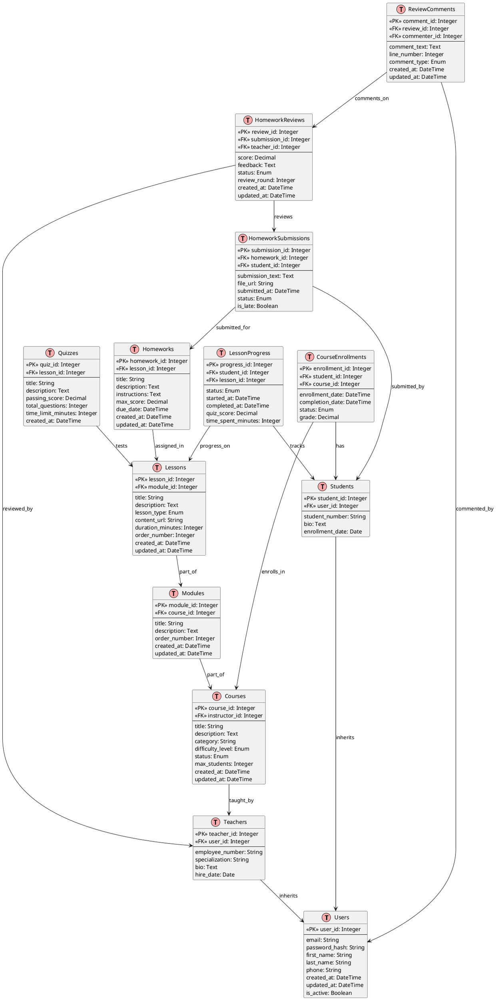

# Entity-Relationship Diagram (ER)
# Online Education Platform Database
# Text-based representation and PlantUML source

## ASCII ER Diagram (Simplified View)

```
┌──────────────────────────────────────────────────────────────────────────────┐
│                    ONLINE EDUCATION PLATFORM DATABASE                        │
└──────────────────────────────────────────────────────────────────────────────┘

┌─────────────┐
│    USERS    │  ◄───────────────────┐
├─────────────┤                      │
│ PK user_id  │                      │ (inheritance)
│ email       │                      │
│ password    │                      │
│ first_name  │                      │
│ last_name   │                      │
│ phone       │                      │
│ is_active   │                      │
│ created_at  │                      │
└─────────────┘                      │
     ▲                                │
     │                                │
     ├────────────────────────────────┼─────────────┐
     │                                │             │
     │ 1:1                            │             │
┌────┴──────────┐          ┌──────────┴────┐    ┌───┴──────────┐
│   STUDENTS    │          │   TEACHERS    │    │   ADMINS     │
├──────────────┤          ├──────────────┤   ├─────────────┤
│ PK student_id│          │ PK teacher_id│   │PK admin_id  │
│ FK user_id ──┼──────────┤ FK user_id ──┤   │ FK user_id ─┤
│student_number│          │employee_num  │   │ level       │
│bio           │          │specialization│   │permissions  │
│enrollment_date│         │hire_date     │   └─────────────┘
└────┬─────────┘          └──────┬───────┘
     │                           │
     │ 1:N                       │ 1:N
     │                           │
┌────┴──────────────────────────┴────────────────────────┐
│                                                        │
│                    ┌────────────────┐                 │
│                    │    COURSES     │                 │
│                    ├────────────────┤                 │
│                    │ PK course_id   │◄─────────────────┤
│                    │ FK instructor_id│ (many courses)  │
│                    │ title          │                 │
│                    │ description    │                 │
│                    │ category       │                 │
│                    │ difficulty     │                 │
│                    │ status         │                 │
│                    │ max_students   │                 │
│                    │ created_at     │                 │
│                    └────┬───────────┘                 │
│                         │                             │
│                         │ 1:N                         │
│                         │                             │
│              ┌──────────┴──────────┐                 │
│              │                     │                 │
│         ┌────┴────────────┐   ┌────┴─────────────┐  │
│         │   MODULES       │   │COURSE_ENROLLMENTS│  │
│         ├─────────────────┤   ├──────────────────┤  │
│         │PK module_id     │   │PK enrollment_id  │  │
│         │FK course_id ────┼──▶│FK student_id ────┼──┘
│         │title            │   │FK course_id ─────┼───┐
│         │description      │   │enrollment_date   │   │
│         │order_number     │   │completion_date   │   │
│         │created_at       │   │status            │   │
│         └────┬────────────┘   │grade             │   │
│              │                 └──────────────────┘   │
│              │ 1:N                    ▲               │
│              │                        │               │
│         ┌────┴────────────┐           │               │
│         │   LESSONS       │           │               │
│         ├─────────────────┤           │               │
│         │PK lesson_id     │           │               │
│         │FK module_id ────┼──────────┐│               │
│         │title            │          ││               │
│         │description      │          ││               │
│         │lesson_type      │          ││               │
│         │content_url      │          ││               │
│         │duration_minutes │          ││               │
│         │order_number     │          ││               │
│         │created_at       │          ││               │
│         └────┬────────────┘          ││               │
│              │                       ││               │
│              ├──────────────┬────────┘│               │
│              │              │         │               │
│         ┌────┴──────┐  ┌────┴──────┐ │               │
│         │ QUIZZES   │  │ HOMEWORKS ├─┤               │
│         ├───────────┤  ├───────────┤ │               │
│         │PK quiz_id │  │PK hw_id   │ │               │
│         │FK lesson  │  │FK lesson  │ │               │
│         │title      │  │title      │ │               │
│         │desc       │  │desc       │ │               │
│         │pass_score │  │max_score  │ │               │
│         │questions  │  │due_date   │ │               │
│         │time_limit │  │created_at │ │               │
│         └───────────┘  └─┬──────────┘ │               │
│                          │            │               │
│                          │ 1:N        │               │
│                          │            │               │
│         ┌────────────────┴──────────┐ │               │
│         │                           │ │               │
│    ┌────┴──────────────┐  ┌─────────┴┴─────────┐     │
│    │LESSON_PROGRESS    │  │HOMEWORK_SUBMISSIONS│     │
│    ├───────────────────┤  ├────────────────────┤     │
│    │PK progress_id     │  │PK submission_id    │     │
│    │FK student_id ────►│  │FK homework_id ────►│     │
│    │FK lesson_id      │  │FK student_id ──────┼─────┘
│    │status            │  │submission_text     │
│    │started_at        │  │file_url            │
│    │completed_at      │  │submitted_at        │
│    │quiz_score        │  │status              │
│    │time_spent        │  │is_late             │
│    └───────────────────┘  └────────┬───────────┘
│                                   │
│                                   │ 1:N
│                                   │
│                            ┌──────┴──────────┐
│                            │HOMEWORK_REVIEWS │
│                            ├─────────────────┤
│                            │PK review_id     │
│                            │FK submission_id │
│                            │FK teacher_id ───┼──┐
│                            │score            │  │
│                            │feedback         │  │
│                            │status           │  │
│                            │review_round     │  │
│                            │created_at       │  │
│                            └────┬────────────┘  │
│                                 │               │
│                                 │ 1:N           │
│                                 │               │
│                         ┌────────┴──────────┐   │
│                         │REVIEW_COMMENTS    │   │
│                         ├───────────────────┤   │
│                         │PK comment_id      │   │
│                         │FK review_id       │   │
│                         │FK commenter_id ───┼────┤
│                         │comment_text       │   │
│                         │line_number        │   │
│                         │comment_type       │   │
│                         │created_at         │   │
│                         └───────────────────┘   │
│                                                  │
└──────────────────────────────────────────────────┘
```

## PlantUML Source Code



## Normalization Analysis

### First Normal Form (1NF)
✓ **Satisfied** - All attributes are atomic
- No multi-valued attributes
- Each cell contains single value
- Example: student_id is single integer, not array

### Second Normal Form (2NF)
✓ **Satisfied** - No partial dependencies
- All non-key attributes depend on entire primary key
- No transitive dependencies through non-key attributes
- Example: CourseEnrollment depends on (student_id, course_id) combination

### Third Normal Form (3NF)
✓ **Satisfied** - No transitive dependencies
- Non-key attributes only depend on primary key
- No non-key attributes depend on other non-key attributes
- Example: course.instructor_id → teacher_id → teacher properties

### Boyce-Codd Normal Form (BCNF)
✓ **Satisfied** - Every determinant is a candidate key
- Stricter than 3NF
- Handles edge cases in 3NF

## Key Relationships

### One-to-Many (1:N)
- User → Students (1 user has 0 or 1 student record)
- User → Teachers (1 user has 0 or 1 teacher record)
- Course → Modules (1 course has many modules)
- Module → Lessons (1 module has many lessons)
- Lesson → Quizzes (1 lesson has many quizzes)
- Lesson → Homeworks (1 lesson has many homeworks)
- Homework → Submissions (1 homework has many submissions)
- Submission → Reviews (1 submission has many reviews)
- Review → Comments (1 review has many comments)

### Many-to-Many (M:N)
- Students ↔ Courses (via CourseEnrollment)
- Students ↔ Lessons (via LessonProgress)

### Self-Referencing
- ReviewComments → Users (commenter_id to user_id)
  - Same user table, different role

## Indexes for Performance

Primary Key Indexes (automatic):
```sql
CREATE INDEX idx_users_email ON users(email);
CREATE INDEX idx_students_enrollment ON students(enrollment_date);
CREATE INDEX idx_teachers_specialization ON teachers(specialization);
CREATE INDEX idx_courses_instructor ON courses(instructor_id);
CREATE INDEX idx_courses_status ON courses(status);
CREATE INDEX idx_enrollments_student ON course_enrollments(student_id);
CREATE INDEX idx_enrollments_course ON course_enrollments(course_id);
CREATE INDEX idx_modules_course ON modules(course_id);
CREATE INDEX idx_lessons_module ON lessons(module_id);
CREATE INDEX idx_lesson_progress_student ON lesson_progress(student_id);
CREATE INDEX idx_lesson_progress_lesson ON lesson_progress(lesson_id);
CREATE INDEX idx_submissions_homework ON homework_submissions(homework_id);
CREATE INDEX idx_submissions_student ON homework_submissions(student_id);
CREATE INDEX idx_reviews_submission ON homework_reviews(submission_id);
CREATE INDEX idx_reviews_teacher ON homework_reviews(teacher_id);
CREATE INDEX idx_comments_review ON review_comments(review_id);
```

## Statistics

- **Total Tables:** 13
- **Total Columns:** 100+
- **Primary Keys:** 13
- **Foreign Keys:** 20
- **Unique Constraints:** 8
- **Check Constraints:** 5
- **Views:** 2

---

## Design Decisions

1. **User Inheritance Pattern**
   - Single Users table with Student/Teacher subtypes
   - Allows shared user authentication
   - Reduces redundancy
   - Supports future Admin, Coordinator roles

2. **Course Structure Hierarchy**
   - Course → Module → Lesson → Quiz/Homework
   - Follows learning progression
   - Supports flexible content organization
   - Enables granular progress tracking

3. **Homework Review Cycle**
   - Separate Submission and Review tables
   - Supports multiple review rounds
   - Captures detailed feedback via Comments
   - Tracks review status and quality

4. **Time Tracking**
   - Both created_at and updated_at
   - Timestamps in lesson_progress
   - Submission tracking
   - Audit trail capability

5. **Soft vs Hard Deletes**
   - RESTRICT on instructor (keep course with teacher)
   - CASCADE on student enrollment (clean deletion)
   - CASCADE on submissions (review cleanup)
   - Allows audit trail preservation

---

**Created:** January 2026  
**Version:** 1.0  
**Status:** 3NF Normalized, Production Ready
